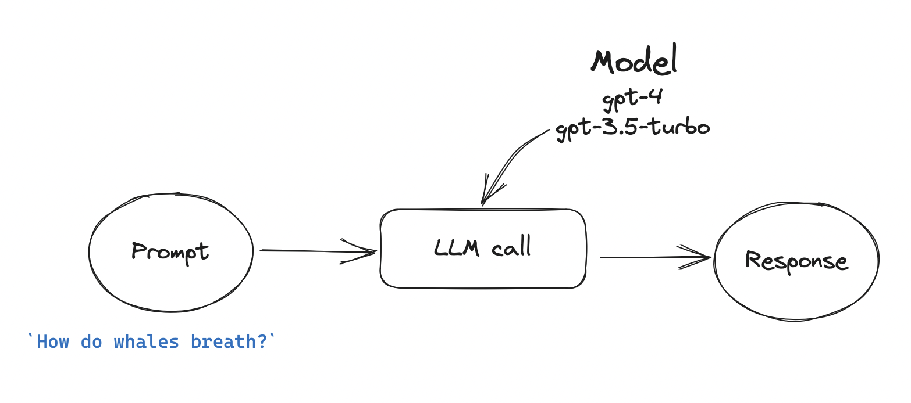

# Generative AI prototypes

Collection of generative AI prototypes, mainly using LLMs.

- [Generative AI prototypes](#generative-ai-prototypes)
  - [Prototypes](#prototypes)
    - [Explain like I am a 3 year old](#explain-like-i-am-a-3-year-old)
    - [Suggesting personalised early-years activities](#suggesting-personalised-early-years-activities)
    - [Suggesting personalised early-years activities w/ external knowledge base](#suggesting-personalised-early-years-activities-w-external-knowledge-base)
      - [Categorise "Tiny Happy People" activities to the EYFS areas of learning and build a vector index](#categorise-the-bbc-activities-to-the-eyfs-areas-of-learning-and-build-a-vector-index)
      - [Generate activities based on the user's query and the "Tiny Happy People" activities](#generate-activities-based-on-the-users-query-and-the-bbc-activities)
  - [Templating messages and functions](#templating-messages-and-functions)
    - [MessageTemplate](#messagetemplate)
    - [FunctionTemplate](#functiontemplate)
  - [Setup](#setup)
    - [Generic setup for working with `pyenv` and `poetry`](#generic-setup-for-working-with-pyenv-and-poetry)
    - [How to install this project](#how-to-install-this-project)
  - [Launch the streamlit app](#launch-the-streamlit-app)
  - [TODO](#todo)

## Prototypes

### Explain like I am a 3 year old
This prototype uses the [OpenAI API](https://beta.openai.com/docs/introduction) to generate an explanation of a concept. The user can enter a concept and the model will explain it in very simple and cheerful terms.



### Suggesting personalised early-years activities
This prototype uses the [OpenAI API](https://beta.openai.com/docs/introduction) to generate [EYFS](https://www.gov.uk/government/publications/early-years-foundation-stage-framework--2)-related activities. The user queries the model with a topic and the model will generate a list of conversations and activities.


### Suggesting personalised early-years activities w/ external knowledge base
This prototype uses the [OpenAI API](https://beta.openai.com/docs/introduction) to generate [EYFS](https://www.gov.uk/government/publications/early-years-foundation-stage-framework--2)-related activities. It leverages external knowledge bases like [BBC's "Tiny Happy People"](https://www.bbc.co.uk/tiny-happy-people/) to append example activities to the prompt based on. The user queries the model with a topic and the model will generate a list of conversations and activities.

Note that to run this prototype, you need to:
1. Get in touch for the BBC Tiny Happy People dataset
2. Run `python src/genai/eyfs/run_classifier.py`
3. Run `python src/genai/eyfs/run_pinecone_index.py`

#### Categorise the BBC activities to the EYFS areas of learning and build a vector index


#### Generate activities based on the user's query and the BBC activities

### WhatsApp interface to early-years prompts

This prototype uses a text messaging app (WhatsApp) as an accessible front end to a large language model (LLM), which can explain simple concepts or generate personalised activity ideas. More information can be found [here](src/genai/whatsapp_bot/).


## Templating messages and functions
`MessageTemplate` and `FunctionTemplate` enables you to define a template for a prompt and work with existing templates. Both classes inherit methods from `BasePromptTemplate`.

### MessageTemplate
Let's create an OpenAI message.

```python
from genai import MessageTemplate

# Set a dummy role and content
my_role = "dummy_role"
my_content = "Hello {text}! This is a json template {{'a': '{value}'}}."


# Use the MessageTemplate as a dataclass, great for experimentation
prompt = MessageTemplate(role=my_role, content=my_content)
prompt
# MessageTemplate(initial_template={'role': 'dummy_role', 'content': "Hello {text}! This is a json template {{'a': '{value}'}}."}, role='dummy_role', content="Hello {text}! This is a json template {{'a': '{value}'}}.")


# Fill in your placeholders, `text` and `value`
prompt.format_message(text="world", value=42)
prompt.content
# "Hello world! This is a json template {'a': '42'}."

prompt.role
# 'dummy_role'

prompt.to_prompt()
# {'role': 'dummy_role', 'content': "Hello world! This is a json template {'a': '42'}."}

# Store the template in a JSON file, good for versioning
prompt.to_json(path="prompt.json")

# Load it back
prompt = MessageTemplate.load("prompt.json")

# Or read a dictionary instead
prompt = MessageTemplate.load({"role": my_role, "content": my_content})
```

### FunctionTemplate
Let's create an OpenAI function. The methods are exactly the same as above, only the atttributes are different.

```python
from genai import FunctionTemplate

# Set a dummy role and content
my_name = "dummy_name"
my_description = "This is a dummy description."
my_parameters = {
    'type': 'object',
    'properties': {'prediction': {'type': 'string',
    'description': 'The predicted area of learning',
    'enum': "{list_of_dummy_categories}"}},
    'required': ['prediction']
    }

# Use the PromptTemplate as a dataclass, great for experimentation
prompt = FunctionTemplate(name=my_name, description=my_description, parameters=my_parameters)
prompt
# FunctionTemplate(initial_template={'name': 'dummy_name', 'description': 'This is a dummy description.', 'parameters': {'type': 'object', 'properties': {'prediction': {'type': 'string', 'description': 'The predicted area of learning', 'enum': '{LIST_OF_DUMMY_CATEGORIES}'}}, 'required': ['prediction']}}, name='dummy_role', description='This is a dummy description.', parameters={'type': 'object', 'properties': {'prediction': {'type': 'string', 'description': 'The predicted area of learning', 'enum': '{LIST_OF_DUMMY_CATEGORIES}'}}, 'required': ['prediction']})


# Fill in your placeholders, `text` and `value`
prompt.format_message(list_of_dummy_categories=["A", "B", "C"])
prompt.parameters
# {'type': 'object', 'properties': {'prediction': {'type': 'string', 'description': 'The predicted area of learning', 'enum': "['A', 'B', 'C']"}}, 'required': ['prediction']}

prompt.name
# 'dummy_name'

prompt.to_prompt()
# {'name': 'dummy_name', 'description': 'This is a dummy description.', 'parameters': {'type': 'object', 'properties': {'prediction': {'type': 'string', 'description': 'The predicted area of learning', 'enum': "['A', 'B', 'C']"}}, 'required': ['prediction']}}

# Store the template in a JSON file, good for versioning
prompt.to_json(path="prompt.json")

# Load it back
prompt = FunctionTemplate.load("prompt.json")

# Or read a dictionary instead
prompt = FunctionTemplate.load({"name": my_name, "description": my_description, "parameters": my_parameters})
```

## Setup


### Generic setup for working with `pyenv` and `poetry`
Assuming you work on a Mac, you can use the following commands to setup your environment from scratch with `pyenv` and `poetry`. Please deactivate any anaconda environments you might have activated before the setup.

1. [Install brew](https://brew.sh/). Confirm you've installed it correctly by running:

```bash
brew --version
``````

2. Install `pyenv`
```bash
brew install pyenv
```

At the end of the installation, `pyenv` will advise you to add the following lines to your `.bash_profile` (or `.zshrc` if you use `zsh`). Do that, save the file and restart your terminal.

```bash
export PYENV_ROOT="$HOME/.pyenv"
command -v pyenv >/dev/null || export PATH="$PYENV_ROOT/bin:$PATH"
eval "$(pyenv init -)"
```

3. Install Python

Install/update a few dependencies

```
brew install openssl readline sqlite3 xz zlib
```

Install Python 3.9.17

```bash
pyenv install 3.9.17
```

Confirm you've installed it correctly by running:

```bash
pyenv versions
```

Run the following commands to set the global Python version to 3.9.17.

```bash
pyenv global 3.9.17
```

Close and reopen your terminal so that the changed take effect.

4. Install `poetry`

You can use the [official installer](https://python-poetry.org/docs/master/#installing-with-the-official-installer):
```bash
curl -sSL https://install.python-poetry.org | python3 -
```

Add poetry to your PATH. **Recommended:** Add the following lines to your `.bash_profile` (or `.zshrc` if you use `zsh`). Save the file and restart your terminal.


```bash
export PATH="/Users/<MYUSERNAME>/.local/bin:$PATH"
```

Confirm your poetry installation:

```bash
poetry --version
```

### How to install this project
1. Assuming you have installed `pyenv` and `poetry` as described above, you can now install this project:

```bash
make init
```

2. Activate the virtual environment:

```bash
source .venv/bin/activate
```

3. Add the secrets to the environment.
   1. Add your OpenAI API key to the `.env` file. See `.env.example` for an example.
   2. The streamlit app is password-protected. You can either remove the password requirement from `app.py` or create a `.streamlit/secrets.toml` file and add `password='<MYPASSWORD>'`.

## Launch the streamlit app
You can use the [Dockerfile](Dockerfile) to launch the streamlit app without installing the repo and its dependencies.

1. Add the required secrets.
   1. Add your OpenAI API key to the `.env` file. See `.env.example` for an example.
   2. The streamlit app is password-protected. You can either remove the password requirement from `app.py` or create a `.streamlit/secrets.toml` file and add `password='<MYPASSWORD>'`.

2. Assuming Docker is install on your local machine, you can build the image with:

```bash
docker build -t <USERNAME>/<YOUR_IMAGE_NAME> .
```

3. Then run the image with:

```bash
docker run -p 8501:8501 <USERNAME>/<YOUR_IMAGE_NAME>
```

4. You can now access the app at `http://localhost:8501`.


### Deploying the app with Heroku

Alternatively, if you would like to deploy the app on a public server, you can use the `Dockerfile.heroku` file, which has a few modifications to make it work with Heroku.

First create the app and make sure to add the environment variables to your Heroku app:

```bash
heroku create
heroku config:set OPENAI_API_KEY=<your_api_key>
```

Then build and push the image to Heroku:

```bash
heroku container:push heroku --recursive --app <your_app_name>
```

Finally, release the image and start the app:

```bash
heroku container:release heroku
heroku ps:scale web=1
```

## TODO

 - Streaming
 - Async calls
 - Parse more than one messages
