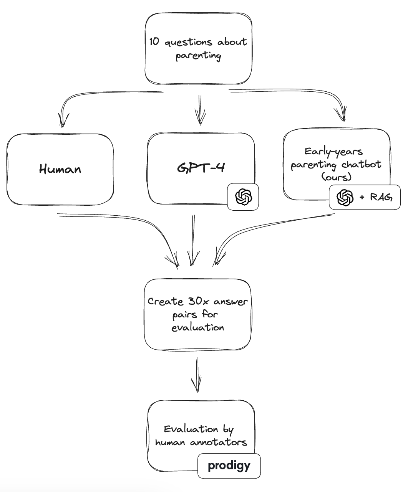
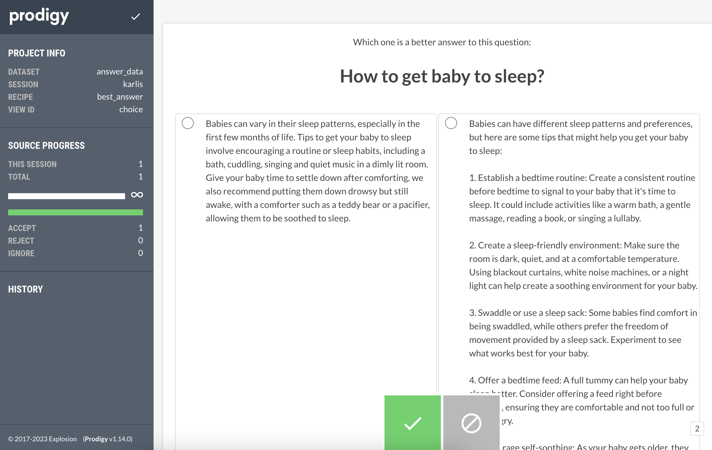

# Using Prodigy platform to evaluate parenting chatbot answers

- [Overview](#overview)
- [Setup instructions](#setup-instructions)
    - [Evaluation data](#evaluation-data)
- [Rating answers in Prodigy](#rating-answers-in-prodigy)
    - [Prodigy recipe](#prodigy-recipe)
    - [Running prodigy locally](#running-prodigy-locally)
    - [Running prodigy on an ec2 instance](#running-prodigy-on-an-ec2-instance)
- [Troubleshooting](#troubleshooting)


## Overview

This is an experiment to test [Prodigy](https://prodi.gy/) as a platform for evaluating the quality of answers from our early-years parenting chatbot prototype. The prototype uses GPT-4 (OpenAI API) as its large language model, and leverages retrieval-augmented generation (RAG) to ground the answers in a trusted knowledge base: in this case, text on the NHS Start for Life website.

In this experiment, we are making pairwise comparisons between answers from the chatbot and answers from humans. We are asking annotators to select the answer that is most appropriate for the question. Note that annotators do not know, which answer is from the chatbot and which is from a human.

We are also adding a third option, which is an answer from the GPT-4 model without any external knowledge base. This is to see whether the use of RAG and grounding the answers in trusted knowledge base improves the perceived quality of the answers.

<p align="center">

</p>

## Setup instructions

To install prodigy, you will need to run
```
python -m pip install --upgrade prodigy -f https://XXXX-XXXX-XXXX-XXXX@download.prodi.gy
```
Replace 'XXXX' with your key (see the official prodigy docs [here](https://prodi.gy/docs/install)).

### Evaluation data

**Human answers**

We used the "top ten most asked parenting questions" from an article on [Kids Collective](https://www.thekidcollective.co.uk/blog/most-asked-parenting-questions.html) website. According to the article, these questions have been sourced from Google Trends and pertain specifically to the UK.

The article also provides short, 1-2 paragraph answers to each of the questions. We used these answers as the reference "human" answers in our evaluation.

While this source is not necessarily an authoritative one (The Kid Collective appears to be primarily a baby retail website), we deemed it as a good starting point for our  evaluation, as the questions are presumably among the most popular ones that caregivers have, and the answers are written in a conversational style that is easy to understand. Moreover, this was more of proof-of-concept, to test out the prodigy platform and the general evaluation approach.

Other freely-available options that we considered were answers to parenting questions by the US-based [Public Broadcasting Service](https://www.pbs.org/wholechild/parents/faqs.html) (also not necessarily an authoritative source) and [Action for Children](https://parents.actionforchildren.org.uk/mental-health-wellbeing/?age=toddler) (they are, however, more specialised in mental health and the answers appeared slightly more difficult to extract from the website). In the future, we could expand this data with more questions and the answers should be provided by caregiving experts.

**LLM answers**

We then simply asked the same 10 questions to our chatbot and to GPT-4 (without RAG), and recorded the answers. The script for generating the GPT-4 answers can be found in `generate_gpt4_answers.py`, whereas the chatbot answers were generating by manually using the chatbot and saving the answers in a log file.

All the answers from the different sources are stored in the `data` folder:
- `answers_human.jsonl` contains the human answers
- `answers_rag.jsonl` contains the answers from the chatbot
- `answers_gpt4.jsonl` contains the answers from GPT-4

## Rating answers in Prodigy

We combined the answers from the different sources and created 30 pairs of answers, using the script `create_eval_data.py`. The final set of answer pairs can be found in `data/answers.jsonl`, in a format that's suitable for Prodigy.

The human annotators are presented with a question and two answers at a time, and asked to choose the better answer from the pair. We can then analyse the pairwise comparisons and, for example, determine the source that has been the most preferred one.



### Prodigy recipe

Prodigy uses a "recipe" to define the annotation task. The recipe for this evaluation can be found in `best_answer_recipe.py`.

We begin by importing various utilities; note that we'll use random module to shuffle data.
```python
import random
from typing import Dict, Generator, List
import prodigy
from prodigy.components.loaders import JSONL
```

Next, we define `GLOBAL_CSS` which is a string of CSS styles. This lets us tailor the appearance of the Prodigy interface. Through this, we can modify font sizes, layout of answer option boxes, container width, and more.

```python
GLOBAL_CSS = (
    ".prodigy-content{font-size: 15px}"
    " .prodigy-option{width: 49%}"
    " .prodigy-option{align-items:flex-start}"
    " .prodigy-option{margin-right: 3px}"
    " .prodigy-container{max-width: 1200px}"
)
```

The `best_answer` function defines a custom Prodigy recipe. With the @prodigy.recipe decorator, we define the expected arguments and set the stage for creating a Prodigy task. This function's role is to process the input data and return it in a format suitable for Prodigy to render.

```python
@prodigy.recipe(
    "best_answer",
    dataset=("The dataset to save to", "positional", None, str),
    file_path=("Path to the questions and answers file", "positional", None, str),
)
def best_answer(dataset: str, file_path: str) -> Dict:
    """
    Choose the best answer out of the given options.

    Arguments:
        dataset: The dataset to save to.
        file_path: Path to the questions and answers file.

    Returns:
        A dictionary containing the recipe configuration.

    """
```

We use Prodigy's JSONL loader to fetch and store our answers dataset into the stream variable, making it ready for subsequent processing. Once data is loaded, the next step is to make sure it's presented in a random sequence and in a format Prodigy understands. By shuffling our data, we prevent potential biases in the order of presentation. After shuffling, the `format_stream` function transforms the questions and answers into a digestible structure, ready for the Prodigy user interface.

```python
    # Load the data
    stream = list(JSONL(file_path))

    def get_shuffled_stream(stream: List) -> Generator:
        random.shuffle(stream)
        for eg in stream:
            yield eg

    # Process the stream to format for Prodigy
    def format_stream(stream: List) -> Dict:
        for item in stream:
            question = item["question"]
            options = [{"id": key, "html": value} for key, value in item["answers"].items()]
            yield {"html": question, "options": options}

    stream = format_stream(get_shuffled_stream(stream))
```

Finally, we lay down the rules for Prodigy by setting up the recipe configuration. This dictionary defines how our task should appear and function within the Prodigy interface. From specifying the 'choice' interface, naming the dataset, feeding the processed data stream, to determining interaction buttons and setting up other interface-related parameters – this configuration is our guide to how the task will run.

```python
    return {
        # Use the choice interface
        "view_id": "choice",
        # Name of the dataset
        "dataset": dataset,
        # The data stream
        "stream": stream,
        "config": {
            # Only allow one choice
            "choice_style": "single",
            "task_description": "Choose the best answer",
            "choice_auto_accept": False,
            # Define which buttons to show
            "buttons": ["accept", "ignore"],
            # Add custom css
            "global_css": GLOBAL_CSS,
            # If feed_overlap is True, the same example can be sent out to multiple users at the same time
            "feed_overlap": True,
            # Port to run the server on
            "port": 8080,
            # Important to set host to 0.0.0.0 when running on ec2
            "host": "0.0.0.0",
            # Setting instant_submit as True means that the user doesn't have to click the "save" button
            "instant_submit": True,
        },
    }
```

### Running prodigy locally

To test the platform locally, run the following command to spin up a Prodigy instance:
```
python -m prodigy best_answer answer_data src/genai/parenting_chatbot/prodigy_eval/data/answers.jsonl -F src/genai/parenting_chatbot/prodigy_eval/best_answer_recipe.py
```
Once you run this line, a URL http://0.0.0.0:8080 should be given to you in the command line. Visit this URL to access the Prodigy app. Note that you will need to specify the user session ID, by adding `?session=your_session_id` to the URL. This is so that Prodigy can keep track of your annotations.

Select an answer to each question, click the green tick button at the bottom, and when you're done, click the "save" icon at the top left.

Fetch the output from your annotations available by running `prodigy db-out answer_data > output.jsonl`.

### Running prodigy on an ec2 instance

To make the platform available to multiple annotators, we can run Prodigy on an ec2 instance. We can then share the URL with the annotators, and they can access the platform from their own computers.

We first spin up an ec2 instance (t2.micro, which is quite cheap at around [$0.0116 per hour](https://aws.amazon.com/ec2/instance-types/t2/)) and used ssh to connect to it.

Once connected to the instance, we cloned this repo (to get the recipe code and answer data) and installed prodigy on the instance using the instructions above.

To make the Prodigy instance run in the background and when we've disconnected from instance, we used `screen` by first simply running screen in the terminal
```shell
screen
```

And then ran the same command to spin up a Prodigy instance:

```shell
python3 -m prodigy best_answer answer_data src/genai/parenting_chatbot/prodigy_eval/data/answers.jsonl -F src/genai/parenting_chatbot/prodigy_eval/best_answer_recipe.py
```

To detach from the screen, press `ctrl+a` and then `d`. The prodigy instance will continue running in the background. To reattach to the screen, run `screen -r`. You can also run `screen -ls` to see the list of screens that are running. To stop a screen and terminate the prodigy instance, run `screen -X -S prodigy_screen_session_id "quit"`.

Finally, you will need to open the port 8080 to allow other users to join from their computers. This can be done by going to the ec2 instance settings on AWS website, and adding a new inbound rule to the security group. The rule should be of type "Custom TCP", port range 8080. If you wish to control who can connect to your Prodigy instance (recommended), you can also specify the allowed IP addresses.


## Troubleshooting

**I'm doing an annotation session in Prodigy, but it says there are already some examples.**

Prodigy has its own SQLite database. Whenever you want to fetch the annotation data, you run
```
prodigy db-out name_of_your_data > output.jsonl
```

If you were running a session earlier and saved annotations to `name_of_your_data`, and then you wish to start a new session using the same session id, Prodigy will tell you that you already have X annotations because you saved X annotations to this dataset earlier.

To clean the database and delete all annotations, you can run:
```
prodigy drop name_of_your_data
```

Alternatively, you can just pick a new session id.
