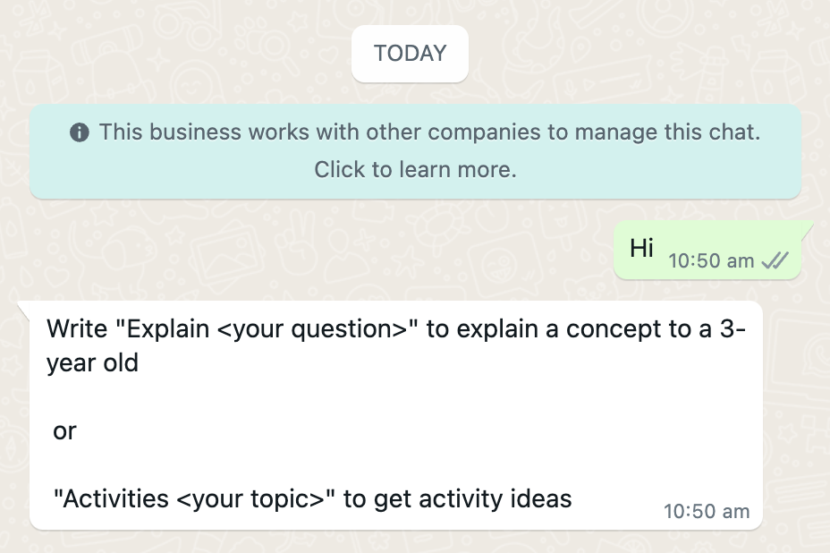
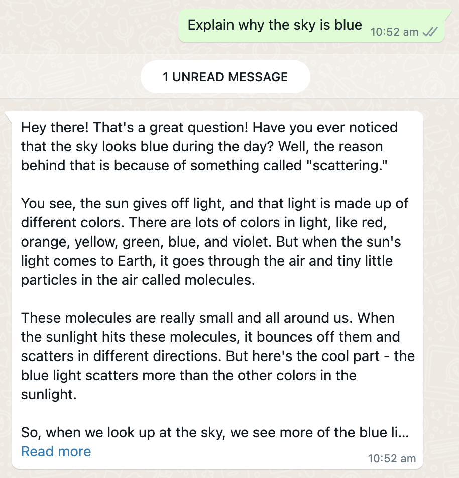
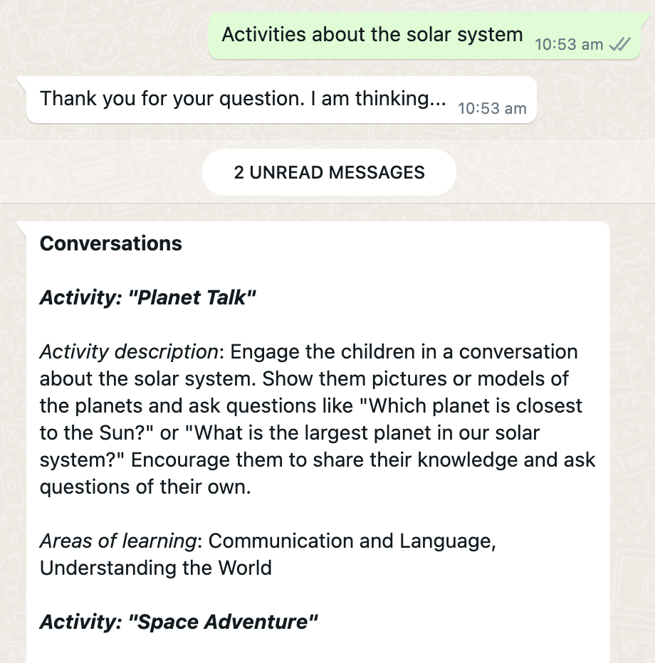
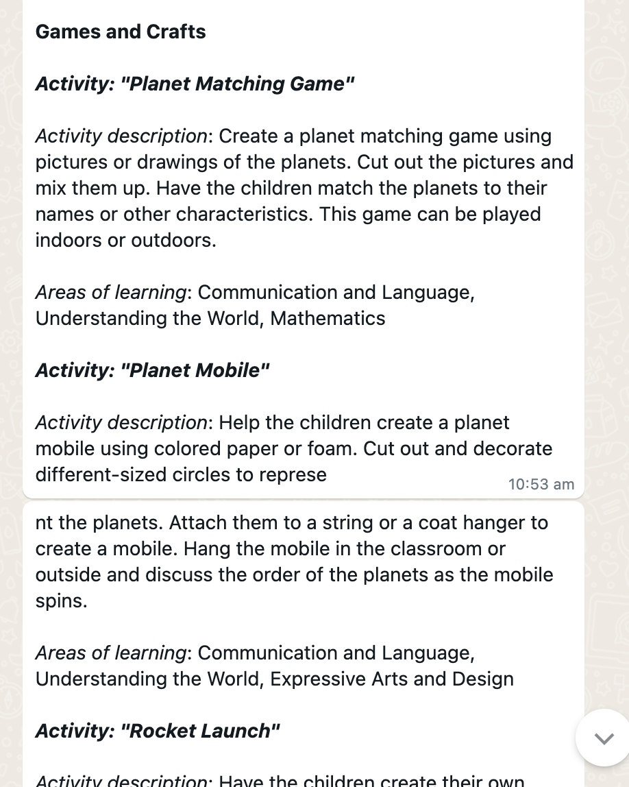
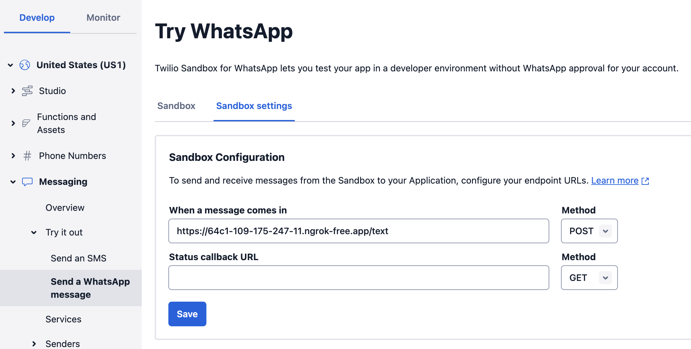

# WhatsApp bot prototype

This prototype provides a messaging front end (WhatsApp) to a large language model (LLM) using prompts related to early-years activities. The idea is that in some situations a widely-adopted messaging platform could be a more natural and accessible user interface for caregivers or educators than a web app.

To set up the WhatsApp bot, you will need to sign up to [Twilio](https://www.twilio.com/), install [ngrok](https://ngrok.com/) and set up a [Heroku](https://www.heroku.com/) account. At the time of writing this, Twilio has a free tier that you can use to test the bot, and Heroku provides affordable plans (less than $10 per month) that will be sufficient for our needs.

- [How it works](#how-it-works)
- [Running the API locally](#running-the-api-locally)
- [Deploying the API on Heroku](#deploying-the-api-on-heroku)


## How it works

Essentially, we use Flask to create an API, it runs on Heroku and can be called via the `/text` endpoint. Twilio provides a WhatsApp contact that receives messages from users and calls the API endpoint when new messages come in.

At the moment, the prototype is not exactly a chatbot as it only allows two types of queries and cannot answer follow-up questions.

You can start the interaction by saying anything, eg 'Hi"

<p align="center">

</p>

The 'Explain <your question>' message triggers the "Explain like I'm 3" prompt

<p align="center">

</p>


The 'Activities <your_topic>' message triggers the personalised activity generation prompt. Note that this prompt is quite long and takes 20+ seconds to respond. This is longer than Twilio's [max timeout](https://www.twilio.com/docs/usage/webhooks/webhooks-connection-overrides) (15 seconds) and hence we first reply with a generic hold message, and then send the actual response when it's ready.

<p align="center">

</p>

This is implemented by the activity message triggering a new thread in which the app calls the OpenAI API and then use Twilio to send the response back to the same user. This should be seen as a quick hack for prototyping purposes, as this might result in a dangling thread that isn't destructed after sending the reply. A better solution would be to use a task queue (eg, Celery) to handle the long-running task.

Note that the response for this prompt is too long for a single message (WhatsApp limit is 1600 characters), and hence we need to split it up in chunks and send as multiple separate messages.

<p align="center">

</p>

Overall, this prototype has been useful to explore the technical feasibility of using WhatsApp as a front end for interacting with a LLM. It also highlights differences between a messaging app and a web app user experience, where the messaging app will be probably better suited for shorter interactions and responses from the LLM (particularly because we can't stream the text character by character to WhatsApp). This means that the prompts that we used for our web app prototype would need to be optimised to provide shorter answers (eg, responding with only one idea at a time).

Possible future iterations could explore using [message history](https://www.twilio.com/docs/sms/tutorials/how-to-retrieve-and-modify-message-history-python) to enable a more natural chatbot interaction and allow the user to configure our prompts (eg, the areas of learning or the age of the kids) using natural language.


## Running the API locally

To run the API locally, navigate to the root of this repo and start the app

```
poetry run python whatsapp_bot.py
```

Start ngrok to expose the app to the internet (assuming the app is using port 5000). This will provide you with a URL that you can use to connect to your app.

```
ngrok http 5000
```

Then in Twilio you'll need to set up a Sandbox for WhatsApp and add the endpoint URL (created by ngrok) of your app under "Sandbox settings" in the box "When the message comes in".



You can now go to WhatsApp, connect with the phone number provided by Twilio and chat with your bot.

## Deploying the API on Heroku

Testing your app locally is great, but what if you close your machine? To keep your WhatsApp bot running even when you rest, we'll deploy it on Heroku using Docker.

First, make sure you've set up heroku on your machine and log in the container registry

```
heroku container:login
```

Then you can create a new app

```
heroku create
```

This will create an app with a random name - this can be changed later.

Set up your environment variables
```
heroku config:set OPENAI_API_KEY=<your_api_key>
heroku config:set TWILIO_ACCOUNT_SID=<your_account_sid>
heroku config:set TWILIO_AUTH_TOKEN=<your_token>
```

Navigate to your app's directory and build the container (because that's where we store the Dockerfile for this prototype)

```
cd src/genai/whatsapp_bot
heroku container:push web --app <your_app_name> --context-path ../../..
```

Then release the container

```
heroku container:release web --app <your_app_name>
```

Start the app

```
heroku ps:scale web=1
```

You can check that the app is working by opening it in your browser

```
heroku open
```

Finally, check the logs (useful if something isn't working)

```
heroku logs --tail
```

Once the app is running OK, you can configure the WhatsApp sandbox as described above, using your new Heroku URL.
